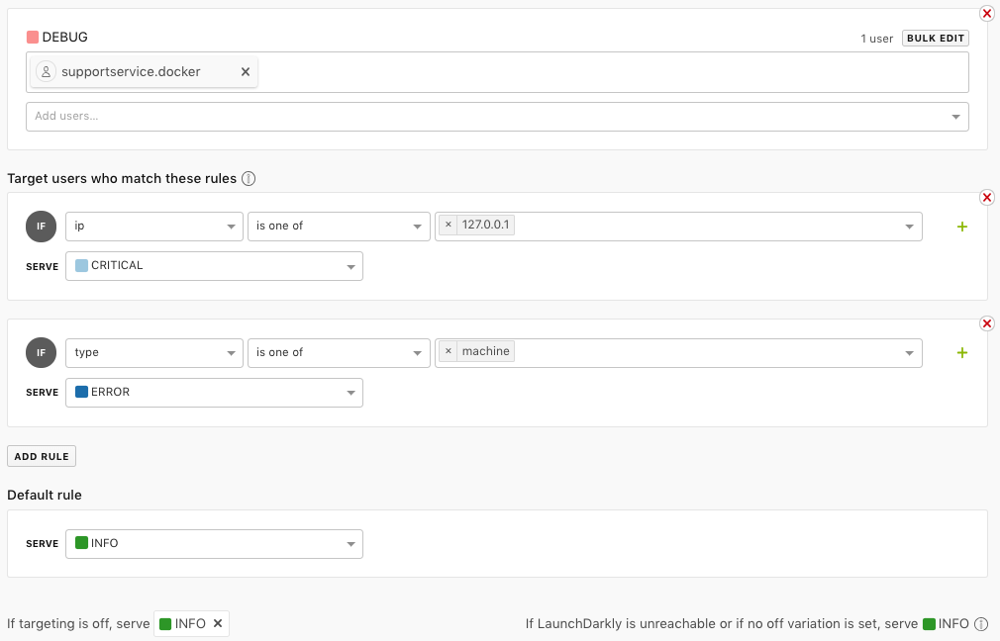

# Use Cases 

Run book for Feature Flagging use cases in the SupportService project 

## Operational 

### Change Logging Level Dynamically 
Debug logs provide a large amount of information to help teams figure out 
the issue when things go wrong. However, running an application in debug 
mode in production is not a viable solution because it would generate a 
massive amount of log data. Traditionally in order to change the logging 
level of an application you would change a configuration file and restart 
the application. 

With feature flags, you are able to dynamically change the logging level of 
your application without having to restart it. 

#### Try It Out
You can try out this use case with the following steps. 

1. In LaunchDarkly, create a new multivariate feature flag called `set-logging-level` 
with the following variations: 
    * Value: 50 Name: CRITICAL
    * Value: 40 Name: ERROR
    * Value: 30 Name: WARNING
    * Value: 20 Name: INFO
    * Value: 10 Name: DEBUG
2. Under the feature flag targeting rules select "INFO" as the variation to serve 
when targeting is turned off. 
3. Turn on targeting and select the "DEBUG" variation. You should now see debug 
logs show up for all subsequent requests. 
4. Turn off targeting. You should no longer see debug logs show up for all
subsequent request.  

#### How This Works 
We have some simple middleware in the application that checks the log level before
each request and updates it if there is a change. You can see this in the 
`app.factory` file. 

```python
@app.before_request
def setLoggingLevel():
    """Set Logging Level Based on Feature Flag

    This uses LaunchDarkly to update the logging level dynamically.
    Before each request runs, we check the current logging level and
    it does not match, we update it to the new value.

    Logging levels are integer values based on the standard Logging library
    in python: https://docs.python.org/3/library/logging.html#logging-levels 

    This is an operational feature flag.
    """
    from flask import request
    logLevel = ldclient.get().variation("set-logging-level", getLdMachineUser(request), logging.INFO)

    app.logger.info("Log level is {0}".format(logLevel))

    # set app 
    app.logger.setLevel(logLevel)
    # set werkzeug
    logging.getLogger('werkzeug').setLevel(logLevel)
    # set root
    logging.getLogger().setLevel(logLevel)
```

When you change the log level via the LaunchDarkly feature flag, it updates the 
variation in local memory. When the variation call occurs on each subsequent 
request it changes the log level for the application. 

#### Further Exploration 
The use case described above is interesting in its own right. But there are also
some other neat things worth discussing. LaunchDarkly has a concept of a "user" 
which in a traditional web application will refer to the human being that is 
using the application. 

However, in operational use cases, there may not be a human on the other 
end of the request. In these cases you can think about the "user" object 
as simply the current request context.

In the example code above, we make a call to the `getLdMachineUser` function to 
get a "machine" user that refers to the server where the app is running.  

```python
def getLdMachineUser(request=None):
    """
    Representation of a non human "user" for use with LaunchDarkly
    """
    if request:
        request_ip = request.remote_addr
    else:
        request_ip = None

    user = {
        "key": socket.gethostname(),
        "ip": request_ip,
        "custom": {
            "type": "machine"
        }
    }

    logging.debug(user)

    return user
```

If we take a closer look at this helper function we will observe the following:
    * The "user" is not a human 
    * The "user" object contains:
        * a key that refers to the hostname 
        * an IP address (if a request context is present) 
        * a custom attribute called "type" 

This means that in addition to changing the logging level for the entire
application. We can also change the logging level for speicific hostnames,
specific or a range of IP addresses, and for specific types. 

The screenshot below illustrates some of the possible targeting rules. 



Notice how we are setting different logging levels based on the hostname, IP, 
and type. Along with serving an entirely different logging level for everything else.